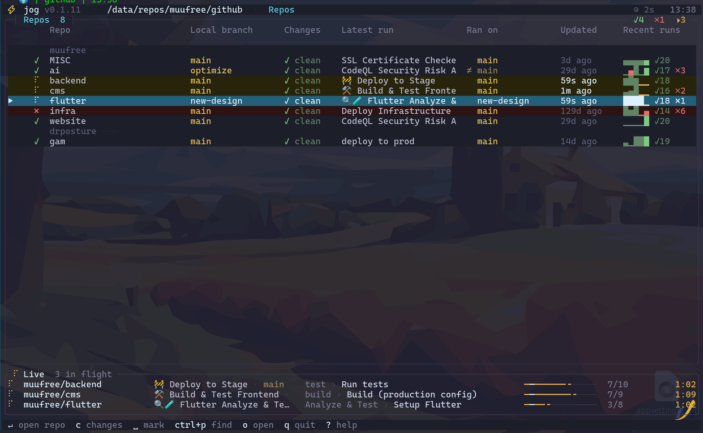

# jog

One screen for every repo you're working in: what the working tree looks like,
what CI is doing, and everything in between.

- **Working tree** — stage, unstage, diff, commit and push, per repo or across
  several at once, with `pre-commit` hook output on screen while it runs.
- **CI** — trigger workflows, watch runs step by step with the running job's
  log tailing live underneath and an ETA learned from the workflow's own recent
  durations, read logs with the errors already found, rerun or cancel.
- **Several repos at a time** — one dashboard with each repo's branch, dirty
  files, latest run and run history; it keeps polling all of them, so a failure
  anywhere finds you.



## Download

Pre-built binaries are on the [Releases](https://github.com/d-shiri/jog/releases/latest) page.

| Platform | File |
|----------|------|
| Linux x86_64 (static) | `jog-linux-x86_64` |
| macOS Apple Silicon | `jog-macos-aarch64` |
| Windows x86_64 | `jog-windows-x86_64.exe` |

```sh
# Linux
curl -fsSL https://github.com/d-shiri/jog/releases/latest/download/jog-linux-x86_64 -o jog
chmod +x jog && sudo mv jog /usr/local/bin/

# macOS
curl -fsSL https://github.com/d-shiri/jog/releases/latest/download/jog-macos-aarch64 -o jog
chmod +x jog && sudo mv jog /usr/local/bin/
```

## Install from source

```sh
cargo install --path .
# or
cargo build --release && ./target/release/jog
```

## Auth

`jog` needs a GitHub token. It uses, in order:

1. `$GITHUB_TOKEN` if set
2. `gh auth token` (requires the [GitHub CLI](https://cli.github.com/) and `gh auth login`)

## Usage

Run from inside a git checkout — the repo is detected from `origin`:

```sh
jog
```

Override the repo explicitly:

```sh
jog --repo owner/name
```

### Subcommands

```sh
jog run <workflow> [ref] [-i KEY=VAL ...]   # fire-and-forget trigger
jog watch <workflow>                        # live status view
jog open <workflow>                         # open latest run in browser
jog repos                                   # multi-repo dashboard
```

`<workflow>` is the workflow file name (e.g. `ci.yml`) or a fuzzy match on its display name.

Run from inside a checkout, or from a directory whose subfolders are checkouts —
see [Multi-repo dashboard](#multi-repo-dashboard).

## Multi-repo dashboard

Two ways to get rows on the dashboard.

**Run `jog` in a directory that isn't a repo but whose subfolders are.** It scans
for checkouts (two levels deep, skipping `node_modules`, `target` and friends),
resolves each one's `origin`, and lists them:

```
~/work $ jog

 ⚡ jog · ~/work · Repos
 ╭ Repos (10  ✓8  ✗1 ) ─────────────────────────────────────────────────────────╮
 │     Repo         Local branch   Latest run          Ran on         Updated   │
 │ ▶ ✓ acme/api     main ●5        🚧 Deploy to Stage    main         2h ago    │
 │   ✓ acme/web     main ✓ ↑2      Build & Test          main         15m ago   │
 │   ✗ acme/infra   fix/db ●1      Deploy to QA        ≠ main         1d ago    │
 ╰──────────────────────────────────────────────────────────────────────────────╯
```

Two different branches, deliberately kept apart:

- **Local branch** — your checkout: the branch you're on, `●n` uncommitted
  files or `✓` clean, and `↑`/`↓` commits ahead of / behind upstream.
- **Ran on** — the branch the *latest CI run* used. A `≠` marks it as a
  different branch from the one you're standing on, which is the usual reason a
  dashboard row looks unfamiliar (a dependabot PR ran more recently than your
  own branch).

**Or list them in config**, for repos you don't have checked out:

```toml
[provider]
repos = ["acme/api", "acme/web", "acme/infra"]
```

Open it any time with `jog repos`, or press `H`. `Enter` on a row switches the
whole app to that repo — workflows come from the local checkout when there is
one (so `workflow_dispatch` inputs and the branch are exact), otherwise from the
API. Repos without a GitHub remote still get a row; they just have no CI half.

While the dashboard is open every listed repo is polled, so a run finishing in
any of them notifies you, not just the one you're sitting in.

## Commit, then run CI

Press `c` on a dashboard row with a local checkout to review its working tree
(`?` shows this table in-app):

| Key | Action |
|-----|--------|
| `Space` | stage / unstage the selected file |
| `a` | stage everything |
| `c` | commit (opens a message prompt) |
| `P` | push — sets upstream on first push |
| `t` | open this repo's workflows, where `t` triggers CI |
| `r` | refresh |

The order matters: `workflow_dispatch` runs against the **remote**, so a commit
that hasn't been pushed won't be the code CI builds. Commit → push → trigger.
`jog` never pushes on its own; `P` is always an explicit keystroke.

## One commit message, several repos

A change that spans four repos otherwise costs four trips: in, stage, commit,
type the message again, push, out. On the dashboard, `Space` marks the repos and
`C` commits all of them with one message.

They go **one at a time**, not in parallel — `git add -A`, then commit, with that
repo's hook output on screen while it runs. A hook that fails stops the whole
batch there and waits:

| Key | Action |
|-----|--------|
| `r` | retry this repo |
| `s` | skip it and carry on |
| `c` | open its working tree to fix it — `Esc` comes back to the pause |
| `Esc` | stop; repos already committed keep their commits |

Nothing is pushed as a side effect. When the last commit lands the batch reports
what it did and asks: `P` pushes every repo it committed, `Esc` finishes.

The per-repo flow above is untouched — this is a second path, not a replacement.

## Watching a pre-commit hook

A repo with a `pre-commit` hook doesn't take 40 milliseconds to commit, it takes
however long pytest and pyright take. `jog` shows that run instead of freezing
for it:

```
 ╭ acme/api — main ─────────────────────────────────────────────────────────────╮
 │ 3 staged   1 unstaged   ~/work/acme-api                                       │
 │ ● M  src/api.py                                                               │
 │                                                                               │
 │╭ ✗ pre-commit hook failed · 2✗ ──────────────────────────────────────────────╮│
 ││ pyright.................................................Failed              ││
 ││ - hook id: pyright                                                          ││
 ││ src/api.py:41:12 - error: "user_id" is not defined                          ││
 ││ 1 error, 0 warnings                                                         ││
 │╰─────────────────────────────────────────────────────────────────────────────╯│
 ╰───────────────────────────────────────────────────────────────────────────────╯
```

- **While it runs** the pane titles itself with the hook and a running clock —
  `⠹ pre-commit hook · 24s` — and follows the output as it arrives, line by
  line, rather than dumping it all at the end.
- **When it fails** the pane stays, and the view lands on the *first error*
  rather than the tail: a test runner's last line is a summary count, and the
  assertion that explains it is further up. The commit is aborted, as git
  intended; nothing is committed behind your back.
- **When it succeeds** the pane closes and the status line reports the commit.

Errors are picked out with the same rules the CI log viewer uses, extended to
the `pre-commit` framework's own `ruff.......Failed` verdict column.

| Key | Action |
|-----|--------|
| `j`/`k` | scroll the output |
| `e`/`E` | jump to the next / previous error |
| `g`/`G` | top / back to following the tail |
| `y` | yank the whole output — to paste into an editor |
| `Esc` | dismiss it, staying on the file list |

`pre-push` hooks get the same treatment on `P`.

The output belongs to the repo, not to the screen: `Esc` out of a repo mid-hook
and its dashboard row says so (`main ●3  ⠹ commit`, or `✗ commit` once a hook
has rejected it), and walking back in picks the output up where it was.

## Fuzzy finder

`Ctrl-P` opens a finder over whatever the current view lists — repos, workflows,
runs, or the jobs and steps of a run. Type to filter, `Enter` to jump the cursor
there. Matching is subsequence-based, so `dtp` finds `deploy_to_prod.yml`.

## Finding the error in a long log

Opening a log **lands on its first error**, not on line 1 — the error is usually
why you opened it, and on a 3,000-line step it is nowhere near the top. Logs with
no errors open at the top as usual, and `g` always goes back there. The title bar
carries the counts (`1,240 lines · 4✗ · 2⚠`) so you can see there is something
wrong without going looking for it.

From there:

- `F` — **focus mode**: fold away everything except errors and warnings plus a
  couple of lines of context around each. What was folded stays visible as a
  marker — `⋯ 399 lines hidden — ↵ to show ⋯` — so you can see where the gaps are
  and how big they are.
- `Enter` on a fold marker opens that stretch back up, for when two lines of
  context aren't enough to understand the failure. Everything else stays folded.
- `e` / `E` — jump to the next / previous error, wrapping at the ends. Errors
  buried inside a collapsed group expand it on the way.
- `log_focus_context` in the config sets how many lines are kept around each
  error (default 2).

Both use the same signals the viewer already colours on: GitHub Actions
`##[error]` / `##[warning]` markup, and lines that start with `error`/`failed`/`warn`.

## Notifications

When a run you were watching finishes, `jog` plays a sound and raises a desktop
notification. Control it with:

```toml
[ui]
notify = "failure"       # "always" (default) · "failure" · "never"
notify_sound = true      # play a sound
notify_desktop = true    # raise an OS notification
```

`notify = "failure"` is the "only tell me when something breaks" mode. A run is
only announced if `jog` saw it in flight first, so starting up never fires a
burst of notifications for runs that finished hours ago.

## The API budget

The header carries how much of the hour's GitHub API budget is spent — `API 46%`
in the top right, dim while there is room, warming through yellow as it fills.

At 90% it turns red, adds the time the budget refills (`API 92% · till 11:36`),
and plays its own alarm once, distinct from the CI sounds: a full bucket is not
a broken build, and the useful reaction is the opposite one — quit `jog` and let
the hour run out rather than spend the rest of it polling.

The reading is refreshed on every poll from `/rate_limit`, which is exempt from
the limit it reports, so watching the meter costs nothing against it. It is
shared: every `gh` command and every other tool on the same token draws from the
same bucket, which is usually how it gets emptied without you noticing.

The dashboard's own polls are conditional requests: each repo's run list is
re-asked with the `ETag` GitHub handed back last time, and the usual answer — a
`304 Not Modified` — is free. A dashboard of quiet repos left open all day
spends almost nothing; only a poll that actually has news pays for it.

## Service health (Uptime Kuma)

CI passing is half the story; the other half is whether what it deployed is
actually up. If you run [Uptime Kuma](https://github.com/louislam/uptime-kuma),
point `jog` at any **published status page** and it reads the same two
unauthenticated JSON endpoints the page itself uses — nothing from GitHub's
budget, no credentials anywhere:

```toml
[uptime_kuma]
url = "https://up.example.com"
status_page = "default"      # the page's slug
```

That alone puts a heart in the header — `♥5` quietly green while everything
answers, `♥4/5` red the moment something doesn't, with the down service named
in the middle of the header from any view.

Monitors whose name matches a repo's name (`backend` → `acme/backend`,
case-insensitive) also attach themselves to that dashboard row as a **Live**
column — `● 44ms` up, `✗ down · 97%` with the day's uptime when not, right
next to the CI status. Monitors named after the service rather than the repo
get one mapping line each:

```toml
[uptime_kuma.map]
"API" = "acme/backend"
"muufree.com" = "acme/website"
```

Health is re-read on the normal poll, off-thread; a Kuma that is slow or gone
never delays the dashboard, and a misconfigured URL is reported once rather
than once per poll.

## Default keys (TUI)

Press **`?`** anywhere in the TUI for the full reference. It reads your actual
config, so remapped keys show their real bindings, and the section for whatever
view you're in floats to the top.

| View      | Keys |
|-----------|------|
| Global    | `?` help · `q` quit · `Esc` back · `j`/`k` move · `Enter` open · `Ctrl-P` find · `H` repos · `y` yank |
| Repos     | `Enter` open repo · `c` review changes · `Space` mark · `C` commit marked · `o` open in browser |
| Batch commit | `r` retry · `s` skip · `c` open the failed repo · `P` push all · `Esc` stop |
| Changes   | `d`/`Enter` diff the file · `Space` stage/unstage · `a` stage all · `c` commit · `P` push · `t` run CI · `r` refresh |
| Hook output | `j`/`k` scroll · `e`/`E` next/prev error · `g`/`G` top/tail · `y` yank · `Esc` dismiss |
| Diff      | `j`/`k` scroll · `d`/`u` page · `g`/`G` top/bottom · `n`/`p` next/prev file · `Space` stage/unstage |
| Workflows | `t` trigger · `w` watch · `o` open in browser |
| Runs      | `t` trigger · `r` rerun · `R` rerun-failed · `x` cancel · `w` watch |
| Run detail| `Enter`/`l` open logs · `D` diff vs last success |
| Logs      | `j`/`k` scroll · `d`/`u` page · `g`/`G` top/bottom · `n`/`p` next/prev step · `a` all steps · `/` search · `e`/`E` next/prev error · `F` focus · `Enter` expand a fold |
| Trigger   | `i`/`Enter` edit field · `Space` cycle choice · `t` submit |

All keys are remappable in `config.toml` (see [Config](#config)).

## Config

`jog` reads `$XDG_CONFIG_HOME/jog/config.toml` (typically `~/.config/jog/config.toml`). All fields are optional.

```toml
[ui]
theme = "dark"
poll_interval_ms = 5000
favorites = ["ci.yml", "deploy.yml"]   # pinned to the top of the list
complete_sound = "/usr/share/sounds/freedesktop/stereo/complete.oga"  # set to "" to disable
fail_sound = ""                        # empty uses the bundled sound
quota_sound = ""                       # alarm when the API budget is nearly spent
notify = "always"                      # "always" · "failure" · "never"
notify_sound = true
notify_desktop = true
log_focus_context = 2                  # context lines kept around each error in focus mode
# github_icon = ""                    # hide the per-repo forge mark (default: the Nerd Font GitHub logo)

[provider]
kind = "github"
repo = "owner/name"                    # optional; otherwise auto-detected from git remote
repos = ["acme/api", "acme/web"]       # multi-repo dashboard rows

[uptime_kuma]                          # service health — see the section above
url = "https://up.example.com"
status_page = "default"                # the status page's slug
[uptime_kuma.map]                      # monitor name -> repo, when names differ
"API" = "acme/api"

[keys]
quit = "q"
back = "Esc"
help = "?"
down = "j"
up = "k"
trigger = "t"
finder = "ctrl+p"
repos_view = "H"
git_view = "c"
git_stage = "Space"
git_stage_all = "a"
git_commit = "c"
git_push = "P"
git_diff = "d"
log_focus = "F"
next_error = "e"
prev_error = "E"
# ... see src/config.rs for the full list
```

## License

MIT — see [LICENSE](LICENSE).
