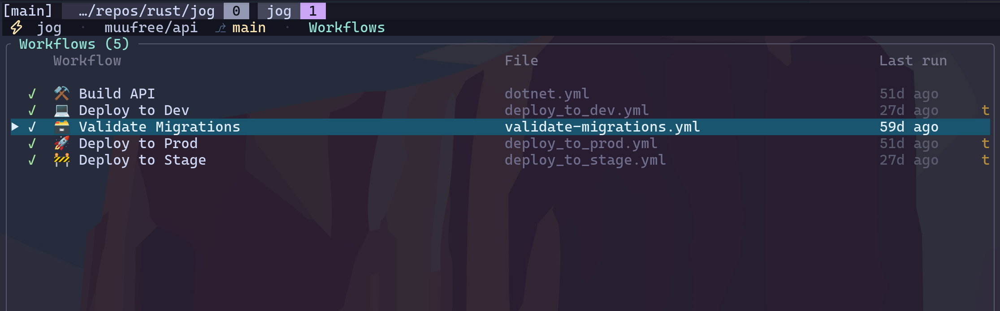
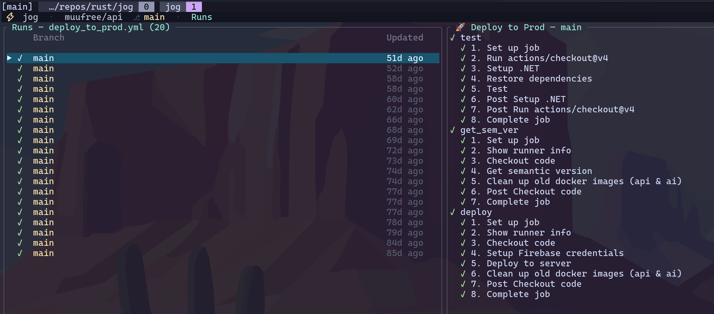

# jog

A terminal UI for browsing and triggering GitHub Actions workflows.




## Download

Pre-built binaries are on the [Releases](https://github.com/d-shiri/jog/releases/latest) page.

| Platform | File |
|----------|------|
| Linux x86_64 (static) | `jog-linux-x86_64` |
| macOS Apple Silicon | `jog-macos-aarch64` |
| Windows x86_64 | `jog-windows-x86_64.exe` |

```sh
# Linux
curl -fsSL https://github.com/d-shiri/jog/releases/latest/download/jog-linux-x86_64 -o jog
chmod +x jog && sudo mv jog /usr/local/bin/

# macOS
curl -fsSL https://github.com/d-shiri/jog/releases/latest/download/jog-macos-aarch64 -o jog
chmod +x jog && sudo mv jog /usr/local/bin/
```

## Install from source

```sh
cargo install --path .
# or
cargo build --release && ./target/release/jog
```

## Auth

`jog` needs a GitHub token. It uses, in order:

1. `$GITHUB_TOKEN` if set
2. `gh auth token` (requires the [GitHub CLI](https://cli.github.com/) and `gh auth login`)

## Usage

Run from inside a git checkout — the repo is detected from `origin`:

```sh
jog
```

Override the repo explicitly:

```sh
jog --repo owner/name
```

### Subcommands

```sh
jog run <workflow> [ref] [-i KEY=VAL ...]   # fire-and-forget trigger
jog watch <workflow>                        # live status view
jog open <workflow>                         # open latest run in browser
jog repos                                   # multi-repo dashboard
```

`<workflow>` is the workflow file name (e.g. `ci.yml`) or a fuzzy match on its display name.

Run from inside a checkout, or from a directory whose subfolders are checkouts —
see [Multi-repo dashboard](#multi-repo-dashboard).

## Multi-repo dashboard

Two ways to get rows on the dashboard.

**Run `jog` in a directory that isn't a repo but whose subfolders are.** It scans
for checkouts (two levels deep, skipping `node_modules`, `target` and friends),
resolves each one's `origin`, and lists them:

```
~/work $ jog

 ⚡ jog · ~/work · Repos
 ╭ Repos (10  ✓8  ✗1 ) ─────────────────────────────────────────────────────────╮
 │     Repo         Local branch   Latest run          Ran on         Updated   │
 │ ▶ ✓ acme/api     main ●5        🚧 Deploy to Stage    main         2h ago    │
 │   ✓ acme/web     main ✓ ↑2      Build & Test          main         15m ago   │
 │   ✗ acme/infra   fix/db ●1      Deploy to QA        ≠ main         1d ago    │
 ╰──────────────────────────────────────────────────────────────────────────────╯
```

Two different branches, deliberately kept apart:

- **Local branch** — your checkout: the branch you're on, `●n` uncommitted
  files or `✓` clean, and `↑`/`↓` commits ahead of / behind upstream.
- **Ran on** — the branch the *latest CI run* used. A `≠` marks it as a
  different branch from the one you're standing on, which is the usual reason a
  dashboard row looks unfamiliar (a dependabot PR ran more recently than your
  own branch).

**Or list them in config**, for repos you don't have checked out:

```toml
[provider]
repos = ["acme/api", "acme/web", "acme/infra"]
```

Open it any time with `jog repos`, or press `H`. `Enter` on a row switches the
whole app to that repo — workflows come from the local checkout when there is
one (so `workflow_dispatch` inputs and the branch are exact), otherwise from the
API. Repos without a GitHub remote still get a row; they just have no CI half.

While the dashboard is open every listed repo is polled, so a run finishing in
any of them notifies you, not just the one you're sitting in.

## Commit, then run CI

Press `c` on a dashboard row with a local checkout to review its working tree
(`?` shows this table in-app):

| Key | Action |
|-----|--------|
| `Space` | stage / unstage the selected file |
| `a` | stage everything |
| `c` | commit (opens a message prompt) |
| `P` | push — sets upstream on first push |
| `t` | open this repo's workflows, where `t` triggers CI |
| `r` | refresh |

The order matters: `workflow_dispatch` runs against the **remote**, so a commit
that hasn't been pushed won't be the code CI builds. Commit → push → trigger.
`jog` never pushes on its own; `P` is always an explicit keystroke.

## Fuzzy finder

`Ctrl-P` opens a finder over whatever the current view lists — repos, workflows,
runs, or the jobs and steps of a run. Type to filter, `Enter` to jump the cursor
there. Matching is subsequence-based, so `dtp` finds `deploy_to_prod.yml`.

## Finding the error in a long log

Opening a log **lands on its first error**, not on line 1 — the error is usually
why you opened it, and on a 3,000-line step it is nowhere near the top. Logs with
no errors open at the top as usual, and `g` always goes back there. The title bar
carries the counts (`1,240 lines · 4✗ · 2⚠`) so you can see there is something
wrong without going looking for it.

From there:

- `F` — **focus mode**: fold away everything except errors and warnings plus a
  couple of lines of context around each. What was folded stays visible as a
  marker — `⋯ 399 lines hidden — ↵ to show ⋯` — so you can see where the gaps are
  and how big they are.
- `Enter` on a fold marker opens that stretch back up, for when two lines of
  context aren't enough to understand the failure. Everything else stays folded.
- `e` / `E` — jump to the next / previous error, wrapping at the ends. Errors
  buried inside a collapsed group expand it on the way.
- `log_focus_context` in the config sets how many lines are kept around each
  error (default 2).

Both use the same signals the viewer already colours on: GitHub Actions
`##[error]` / `##[warning]` markup, and lines that start with `error`/`failed`/`warn`.

## Notifications

When a run you were watching finishes, `jog` plays a sound and raises a desktop
notification. Control it with:

```toml
[ui]
notify = "failure"       # "always" (default) · "failure" · "never"
notify_sound = true      # play a sound
notify_desktop = true    # raise an OS notification
```

`notify = "failure"` is the "only tell me when something breaks" mode. A run is
only announced if `jog` saw it in flight first, so starting up never fires a
burst of notifications for runs that finished hours ago.

## Default keys (TUI)

Press **`?`** anywhere in the TUI for the full reference. It reads your actual
config, so remapped keys show their real bindings, and the section for whatever
view you're in floats to the top.

| View      | Keys |
|-----------|------|
| Global    | `?` help · `q` quit · `Esc` back · `j`/`k` move · `Enter` open · `Ctrl-P` find · `H` repos · `y` yank |
| Repos     | `Enter` open repo · `c` review changes · `o` open in browser |
| Changes   | `d`/`Enter` diff the file · `Space` stage/unstage · `a` stage all · `c` commit · `P` push · `t` run CI · `r` refresh |
| Diff      | `j`/`k` scroll · `d`/`u` page · `g`/`G` top/bottom · `n`/`p` next/prev file · `Space` stage/unstage |
| Workflows | `t` trigger · `w` watch · `o` open in browser |
| Runs      | `t` trigger · `r` rerun · `R` rerun-failed · `x` cancel · `w` watch |
| Run detail| `Enter`/`l` open logs · `D` diff vs last success |
| Logs      | `j`/`k` scroll · `d`/`u` page · `g`/`G` top/bottom · `n`/`p` next/prev step · `a` all steps · `/` search · `e`/`E` next/prev error · `F` focus · `Enter` expand a fold |
| Trigger   | `i`/`Enter` edit field · `Space` cycle choice · `t` submit |

All keys are remappable in `config.toml` (see [Config](#config)).

## Config

`jog` reads `$XDG_CONFIG_HOME/jog/config.toml` (typically `~/.config/jog/config.toml`). All fields are optional.

```toml
[ui]
theme = "dark"
poll_interval_ms = 5000
favorites = ["ci.yml", "deploy.yml"]   # pinned to the top of the list
complete_sound = "/usr/share/sounds/freedesktop/stereo/complete.oga"  # set to "" to disable
fail_sound = ""                        # empty uses the bundled sound
notify = "always"                      # "always" · "failure" · "never"
notify_sound = true
notify_desktop = true
log_focus_context = 2                  # context lines kept around each error in focus mode

[provider]
kind = "github"
repo = "owner/name"                    # optional; otherwise auto-detected from git remote
repos = ["acme/api", "acme/web"]       # multi-repo dashboard rows

[keys]
quit = "q"
back = "Esc"
help = "?"
down = "j"
up = "k"
trigger = "t"
finder = "ctrl+p"
repos_view = "H"
git_view = "c"
git_stage = "Space"
git_stage_all = "a"
git_commit = "c"
git_push = "P"
git_diff = "d"
log_focus = "F"
next_error = "e"
prev_error = "E"
# ... see src/config.rs for the full list
```

## License

MIT — see [LICENSE](LICENSE).
